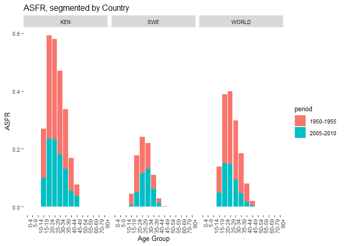
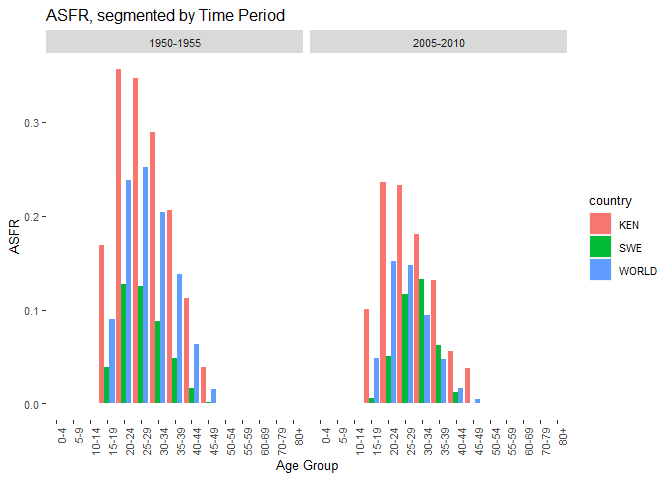
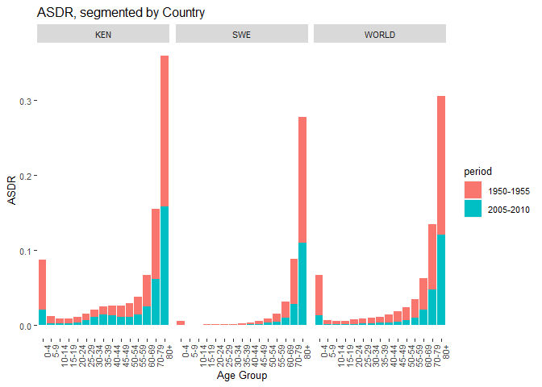
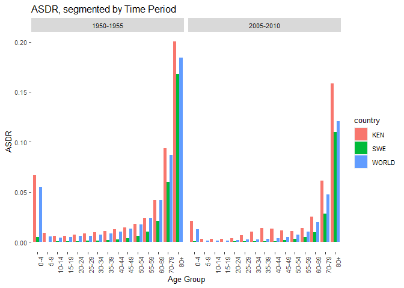

Problem Sheet 1
===============

Problem Set A
-------------

Imported dplyr for dataframe manipulation. Used expanded grid to create
the variable of all possible outcomes

``` r
library(dplyr)

#Create vector of dice values
dice <- c(1,2,3,4,5,6)

#use expand.grid to return all possible die combinations
S <- expand.grid(dice,dice,dice)

#create new variable with sum
S <- S %>% mutate(Value=Var1+Var2+Var3)

#Calculate probability of sum of eyes=12 
prob_sum_12 <- nrow(S[S$Value == "12",])/nrow(S)

#Show value
prob_sum_12
```

    ## [1] 0.1157407

Wanted to compare result with `sample` function’s result. Results were
similar

``` r
#confirm with sample
set.seed(1510)
N1 <- 1000000
diceRolls <- replicate(3, sample(dice, N1, replace = TRUE))
sum_12_2 <- sum(diceRolls[,1] + diceRolls[,2] + diceRolls[,3] == 12)
prob_sum_12_2 <- sum_12_2/N1
prob_sum_12_2
```

    ## [1] 0.11543

Next, needed to create vector of probabilities for biased die. Then
renamed the columns and binded the probabilities to the variables

``` r
#create vector of probability
biased_prob <- c(0.125,0.125,0.125,0.125,0.125,0.375)
prob_grid <- expand.grid(biased_prob,biased_prob,biased_prob)
#rename columns 
prob_grid <- prob_grid %>% rename(Prob1=Var1, Prob2=Var2, Prob3=Var3)

#join the dfs together
S <- bind_cols(S, prob_grid)
```

Ran `sample` to estimate probability of sum being 12 for biased dice

``` r
# Calculate probability that sum is 12 
set.seed(1510)
N2 <- 1000000
BdiceRolls <- replicate(3, sample(dice, N2, replace = TRUE, prob = biased_prob))
biased_sum_12 <- sum(BdiceRolls[,1] + BdiceRolls[,2] + BdiceRolls[,3] == 12)
prob_biased_12 <- biased_sum_12/N2
prob_biased_12
```

    ## [1] 0.107438

Problem Set B
-------------

Imported library `ggplot2` for plotting and imported data

``` r
library(ggplot2)

#import CSVs
kenya_raw <- read.csv("P:/Adulting/Uni/Year 3/Papers/QM/Tutorial 1/kenya.csv")
sweden_raw <- read.csv("P:/Adulting/Uni/Year 3/Papers/QM/Tutorial 1/sweden.csv")
world_raw <- read.csv("P:/Adulting/Uni/Year 3/Papers/QM/Tutorial 1/world.csv")
```

Created functions to calculate ASFR, TFR, and ASDR

``` r
#create asfr, tfr, asdr function 
asfr_tfr_asdr <- function(dataset){

  dataset <- dataset %>% mutate(asfr = births/py.women)
  dataset <- dataset %>% mutate(asdr = deaths/rowSums(dataset[,c("py.men","py.women")]))

  tfr1 <- dataset %>% slice(4:10) %>% summarise(result=sum(asfr))
  tfr2 <- dataset %>% slice(19:25) %>% summarise(result=sum(asfr))

  print(paste("The TFR for the period 1950 - 1955 is: ", (format(round((tfr1[1]*5),2)))))
  print(paste("The TFR for the period 2005 - 2010 is: ", (format(round((tfr2[1]*5),2)))))
  print(paste("This was a ", (format(round((((tfr2[1]-tfr1[1])/tfr1[1])*100),2))), "% change between the 2 periods"))
  return(dataset)
}
```

Ran the functions to create new dataframes to store the ASFR and ASDR
and to output TFR.

``` r
#Compute asdr, asfr, tfr for datasets
kenya_comp <- asfr_tfr_asdr(kenya_raw)
```

    ## [1] "The TFR for the period 1950 - 1955 is:  7.59"
    ## [1] "The TFR for the period 2005 - 2010 is:  4.88"
    ## [1] "This was a  -35.72 % change between the 2 periods"

``` r
sweden_comp <- asfr_tfr_asdr(sweden_raw)
```

    ## [1] "The TFR for the period 1950 - 1955 is:  2.23"
    ## [1] "The TFR for the period 2005 - 2010 is:  1.9"
    ## [1] "This was a  -14.56 % change between the 2 periods"

``` r
world_comp <- asfr_tfr_asdr(world_raw)
```

    ## [1] "The TFR for the period 1950 - 1955 is:  5.01"
    ## [1] "The TFR for the period 2005 - 2010 is:  2.54"
    ## [1] "This was a  -49.2 % change between the 2 periods"

TFR is defined as the the average number of children given birth to by
women who live through their entire reproductive age. TFRs may be linked
to the social and economic development of a country and hence changes in
TFR may provide insight into such developments.

According to [Our World in
Data](https://ourworldindata.org/fertility-rate), the three major
reasons for a decline in TFR are the empowerment of women, declining
child mortality, and rising costs of bringing up children. Across all
three datasets, we see that there was a negative change in TFR. In
particular, the % change in TFR for Kenya was more than 2 times that of
the % change in TFR for Sweden. This suggests that there was a greater
degree of socio-economic development in Kenya than in Sweden between the
periods of 1955 to 2005. Across the world, there was a decline in TFR of
approximately 50%. This was greater than the decline in Kenya and
Sweden, suggesting that there were parts of the world that experienced
even more drastic declines in TFR, which significantly brought down the
world average TFR.

Combined the dataframes for easier plotting

``` r
#merge dfs
merge_comp <- bind_rows(kenya_comp,sweden_comp,world_comp)
merge_comp$age <- factor(merge_comp$age, levels = unique(merge_comp$age))
```

``` r
#plot asfr
asfr_plot <- merge_comp %>%
  ggplot(aes(age, asfr, fill=period)) +
  geom_col() +
  facet_grid(~country) +
  theme(text = element_text(size=10), axis.text.x = element_text(angle=90, hjust=1),
        panel.background = element_blank()) +
  labs(title = "ASFR, segmented by Country", x = "Age Group", y = "ASFR") 
asfr_plot
```



First, looking at ASFR by country, it was clear that each country
experienced a decline in ASFR, across all age groups. We also see that
the highest ASFR for Sweden was from 25 - 34, which for Kenya it was 20
- 29. This might be a result of the differences in education/employment
of women in the countries, with higher rates of education and employment
typically leading to later births
([voxeu](https://voxeu.org/article/jobs-and-kids-female-employment-and-fertility-rural-china)).

``` r
#plot asfr with country comparison
asfr_plot_c <- merge_comp %>%
  ggplot(aes(age, asfr, fill=country)) +
  geom_col(position="dodge") +
  facet_grid(~period) +
  theme(text = element_text(size=10), axis.text.x = element_text(angle=90, hjust=1),
        panel.background = element_blank()) +
  labs(title = "ASFR, segmented by Time Period", x = "Age Group", y = "ASFR") 
asfr_plot_c
```



Looking at ASFR by time period, it remains clear that Kenya has
consistently higher ASFRs than the world across age groups. Sweden, in
contrast, has a lower ASFR compared to the world. For the 45 - 49,
Sweden’s ASFR declines almost to 0 in contrast to Kenya and the World.
This is interesting given that one would expect women in more
economically developed countries (MEDC) to continue having children at
later ages given the higher standards of healthcare and being busy with
employment at younger ages. However, this is not the case and this might
be an effect of family planning education and biological education, with
women in MEDCs acknowledging the risks associated with older age
pregnancy.

``` r
#plot asdr
asdr_plot <- merge_comp %>%
  ggplot(aes(age, asdr, fill=period)) +
  geom_col() +
  facet_grid(~country) +
  theme(text = element_text(size=10), axis.text.x = element_text(angle=90, hjust=1), 
        panel.background = element_blank()) +
  labs(title = "ASDR, segmented by Country", x = "Age Group", y = "ASDR") 
asdr_plot
```



Looking at ASDR, Kenya and the World have two peaks, one at 0 - 5 and
the other at 70+. In contrast, Sweden’s data shows a peak at 70+, with a
small blimp at 0 - 5. This suggests a lower infant mortality rate,
consistent with the relatively higher standards of healthcare in Sweden
vis a vi Kenya. Across Kenya, Sweden, and the world, ASDR has fallen for
every age group. This decline in ASDR suggests [rising standards of
healthcare](https://www.nber.org/digest/mar02/w8556.html) across Kenya,
Sweden, and the world, with greater concentration of mortality at older
ages.

``` r
#plot asdr with country comparison
asdr_plot_c <- merge_comp %>%
  ggplot(aes(age, asdr, fill=country)) +
  geom_col(position="dodge") +
  facet_grid(~period) +
  theme(text = element_text(size=10), axis.text.x = element_text(angle=90, hjust=1),
        panel.background = element_blank()) +
  labs(title = "ASDR, segmented by Time Period", x = "Age Group", y = "ASDR") 
asdr_plot_c
```



Segmented by time period, it is clear that Kenya’s ASDR across age
groups remains relatively high compared to the world, even in the period
of 2005-2010. In contrast, Sweden’s ASDR remained relatively lower
compared to the world across age groups, with the exception of the 80+
age group. However, the 80+ ASDR is arguably not as indicative of a
country’s healthcare given the higher rate of natural deaths in persons
80+ years of age.
